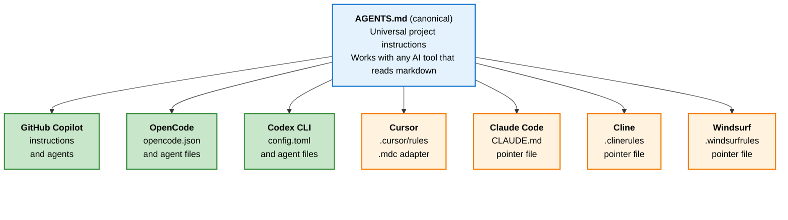
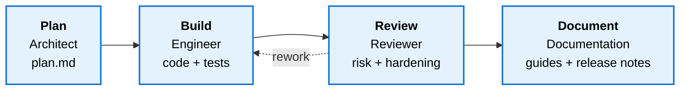

# Mnemix Context

A config-driven, multi-platform toolkit for generating AI coding resources — instructions, agents, skills, context files, and platform adapters — tailored to a single software repository and any AI coding assistant.

---

## Overview

Every AI coding tool performs better when it understands your project: the tech stack, coding patterns, domain language, and security requirements. Mnemix Context generates that understanding as a set of structured files that live in your repo and work across platforms.

You describe your project once in a YAML config. The toolkit renders a full set of **agents, skills, context files, and platform adapters** that your AI tools pick up automatically — no copy-pasting system prompts, no repeating yourself across tools.

### Progressive Disclosure Architecture

The toolkit uses a **3-level progressive disclosure** pattern to minimize token waste:

| Level    | Always Loaded? | What | Purpose |
|----------|----------------|------|---------|
| **L1 — Router** | Yes (~60 lines) | `AGENTS.md` | Routes agents to the right instructions and context files |
| **L2 — Instructions** | On demand | `instructions/*.md` | Coding standards, security patterns, git workflow, naming |
| **L3 — Context** | On demand | `context/*.md` + `.jsonl` / `.yaml` | Deep project knowledge: architecture, schema, roles, APIs |

Agents start with L1, load L2 modules relevant to their task, and dip into L3 only when they need specific data — keeping token budgets tight.

### Mnemix Add-On (Optional)

The vertical L1–L3 layers define **static ground truth** — the rules of the project. **Mnemix** is an optional external add-on that provides **read/write episodic memory** across sessions.

```
                    L1 AGENTS.md (Router)
                         │
                    L2 instructions/*.md (Rules)
                         │
                    L3 context/*.md + .jsonl (Knowledge)
                         │
═════════════════════════╪═══════════════════════════════  ← Mnemix
past ── session N-2 ── session N-1 ── session N ── now      (episodic memory)
```

Enable it with `features.integrations.mnemix: true`, install the official package with `pip install mnemix`, and initialize a store with `mnemix --store .mnemix init`.

### Multi-Platform Architecture

The toolkit uses **open standards as the single source of truth**, with thin adapters for each platform:



Only files for your **selected platforms** are generated. You choose which ones during setup.

---

## What You Get: AI-Powered Development Workflow

The toolkit generates a full set of **agents, skills, context files, and platform adapters** that cover the entire software development lifecycle. Each resource type has a specific role.

### Workflow



### Components At A Glance

| Layer | What it gives you | Footprint |
|-------|-------------------|-----------|
| **Agents** | 4 focused roles with clear boundaries | Engineer, Reviewer, Documentation, Architect |
| **Skills** | Auto-activating task playbooks | 12 core skills + optional Mnemix memory |
| **Context** | Structured project knowledge in `.ai/context/` | 10 prose files + 6 structured data files |
| **Platform Output** | Native configs and adapters for your chosen tools | Copilot, OpenCode, Codex, Cursor, Claude, Cline, Windsurf |

The short version: `AGENTS.md` routes work, skills add task-specific behavior, context files hold durable project knowledge, and platform output exposes the same system to each coding tool.

<details>
<summary><strong>Component Details</strong></summary>

| Component | Includes |
|-----------|----------|
| **Agents** | `engineer`, `reviewer`, `documentation`, `architect` |
| **Skill coverage** | API work, frontend, backend, unit testing, e2e testing, code review, git workflow, planning, documentation |
| **Context files** | architecture, project structure, schema, access control, roles/permissions, API reference, glossary, testing strategy, integrations |
</details>

### Platform Support

Use native integrations where available; adapters point other tools back to the same canonical `AGENTS.md`.

| Platform | Mode | Output |
|----------|------|--------|
| **GitHub Copilot** | Native | `.ai/copilot-instructions.md`, `.ai/agents/*.agent.md` |
| **OpenCode** | Native | `.ai/opencode/opencode.json`, `.ai/opencode/agents/*.md` |
| **Codex CLI** | Native | `.ai/codex/config.toml`, `.ai/codex/agents/*.toml` |
| **Cursor** | Adapter | `.ai/cursor-rules.mdc` |
| **Claude Code** | Adapter | `.ai/CLAUDE.md` |
| **Cline** | Adapter | `.ai/clinerules` |
| **Windsurf** | Adapter | `.ai/windsurfrules` |

---

## Getting Started

### Prerequisites

- **Python 3.8+** (check: `python3 --version`)
- **PyYAML** (auto-installed by the setup script if missing)
- **VS Code with GitHub Copilot** (for the recommended AI-assisted setup)
- **VS Code workspace that includes your project code** — the bootstrap agent scans files in the open repo to auto-detect your stack, patterns, and architecture

### Step 1: Open Your Workspace

Make sure your VS Code workspace includes at minimum your **project source code**. For best results, also include infrastructure, migrations, and docs that already live in the same repository.

### Step 2: Clone the Toolkit

```bash
git clone https://github.com/your-org/mnemix-context.git
```

### Step 3: Add Reference Documents (Optional but Recommended)

If you have project documents that aren't part of your codebase, drop them into the toolkit's `reference/` directory before running the bootstrap agent:

Examples of useful reference files:
- **Database extracts** — role/privilege query results, table listings, schema dumps (CSV, SQL, or text)
- **API specs** — OpenAPI/Swagger files, Postman collections
- **Architecture docs** — system diagrams, data flow documents
- **Role/permission matrices** — RBAC spreadsheets, access control exports
- **Domain glossaries** — business terminology, acronym lists

The bootstrap agent reads these first and uses them as primary sources when populating context files. They're typically more accurate than what can be inferred from code alone.

> **Tip:** For roles and permissions, run a few SQL queries against your database and save the results as CSV files. The bootstrap agent will parse them into structured `.jsonl` context files automatically. Only extract **configuration and reference data** (role names, permission codes, table schemas) — never extract sensitive data such as PHI, PII, credentials, or actual user records.

For more information on supported formats and examples, see [reference/README.md](reference/README.md).

### Step 4: Copy the Bootstrap Agent to Your Project

Navigate to the root of your project, then run:

```bash
mkdir -p .github/agents
cp mnemix-context/setup/bootstrap.agent.md .github/agents/mnemix-context-bootstrap.agent.md
```

Then reload VS Code so it picks up the new agent:

> **Cmd+Shift+P** → `Developer: Reload Window`

This places the setup agent where Copilot can find it. The rest of Mnemix Context stays in its own repo — only this one file gets copied.

### Other Setup Paths

If you are not using GitHub Copilot for setup:

- Use [setup/SETUP.md](/Users/micah/Projects/mnemix-context/setup/SETUP.md) as the tool-neutral setup workflow for Codex, OpenCode, Cursor, Claude Code, Cline, or Windsurf
- After generation, native `setup` agents are available for Copilot, OpenCode, and Codex in the generated `.ai/` output

### Step 5: Run the Bootstrap Agent (Recommended)

1. Open **Copilot Chat** in VS Code
2. Click the **chat mode dropdown** (bottom left of the chat panel) and select **Toolkit Bootstrap**
3. Send the message: **"Set up Mnemix Context for this project"**

The agent walks you through the entire setup interactively:

1. **Auto-detects** your tech stack by scanning `package.json`, `angular.json`, `Dockerfile`, database configs, auth middleware, CI pipelines, and more
2. **Interviews you** on anything it couldn't detect — domain terminology, data sensitivity, naming conventions
3. **Lets you choose platforms** — Copilot, OpenCode, Cursor, Claude, Cline, Windsurf, or any combination
4. **Generates `toolkit.config.yaml`** with accurate values based on what it found
5. **Runs the template engine** to produce all output files in `.ai/`
6. **Auto-populates context files** by scanning your codebase for real services, database tables, roles, and middleware patterns
7. **Presents a summary** for your review — you can iterate on any corrections

When it finishes, your project has fully customized AI resources in `.ai/` ready to use.

### Step 6: Copy to Your Workspace and Create Symlinks

```bash
# Copy the generated .ai/ directory to your workspace root
cp -r mnemix-context/.ai /path/to/your-project/.ai

# Create platform symlinks
cd /path/to/your-project
bash .ai/setup-links.sh
```

Commit the `.ai/` directory and symlinks to your repo.

---

## Manual Setup (Alternative)

If you prefer to configure manually or can't use the bootstrap agent:

### 1. Copy and Edit the Config

```bash
# Start from an example closest to your stack
cp mnemix-context/setup/examples/angular-node-aws.yaml toolkit.config.yaml
# or
cp mnemix-context/setup/examples/react-python-gcp.yaml toolkit.config.yaml
```

Open `toolkit.config.yaml` and fill in your project details. Key sections:

```yaml
project:
  name: "My Project"
  description: "What this project does"
  jira_key: "PROJ"
  org_name: "My Organization"
  task_tracking_system: "Jira"
  task_tracking_notes: "Issues are planned in Jira and linked in PR titles"

platforms:
  # Universal open standards (recommended: keep all true)
  agents_md: true           # AGENTS.md — canonical instructions
  skills: true              # .ai/skills/ — auto-activating skills
  context_files: true       # .ai/context/ — project knowledge base

  # Platform-specific adapters (enable the ones your team uses)
  copilot: true             # GitHub Copilot
  opencode: false           # OpenCode
  codex: false              # Codex CLI
  cursor: false             # Cursor
  claude: false             # Claude Code
  cline: false              # Cline
  windsurf: false           # Windsurf

tech_stack:
  frontend:
    framework: "Angular 18"
    language: "TypeScript 5.x"
  backend:
    runtime: "Node.js 20"
    framework: "Express"
  databases:
    - name: "Aurora PostgreSQL"
      type: "relational"
  cloud:
    provider: "AWS"
  auth:
    provider: "Okta SSO"
    strategy: "JWT + RBAC"
```

See the full schema with all options in [toolkit.config.yaml](toolkit.config.yaml).

### 2. Generate Output Files

```bash
# Generate output files into .ai/
./mnemix-context/setup/generate.sh --config toolkit.config.yaml --output /path/to/your-project

# Or preview first without writing anything
./mnemix-context/setup/generate.sh --config toolkit.config.yaml --output /path/to/your-project --dry-run
```

### 3. Create Platform Symlinks

After generation, create the symlinks that each AI platform expects:

```bash
cd /path/to/your-project
bash .ai/setup-links.sh
```

The script auto-detects which platform files exist in `.ai/` and creates only the relevant symlinks. Use `--dry-run` to preview or `--clean` to remove managed symlinks.

### 4. Populate Context Files

The generated `.ai/context/` directory contains stub files with `TODO` markers. Fill them in with your project's actual architecture, schemas, and access control details.

- **Prose files** (`.md`) — Architecture overviews, auth patterns, testing strategy
- **JSONL files** (`.jsonl`) — Tabular data like roles, permissions, endpoints, repos, glossary terms (one JSON object per line)
- **YAML files** (`.yaml`) — Hierarchical data like database schemas

The more complete these are, the better your AI tools will understand your project.

---

## Keeping Context Files Up to Date

Projects evolve — schemas change, endpoints get added, roles are modified. The toolkit includes a **Context Updater** agent that refreshes your `.ai/context/` files without re-running the full bootstrap.

### Who Runs Updates

Context updates are typically performed by the **Tech Lead or Architect**, not every developer. The updater agent lives in `.ai/update/` and is only copied into the agents directory when needed — keeping the everyday agent dropdown clean.

### Quick Start

```bash
# 1. Copy the update agent (only when you need to run an update)
cp .ai/update/update.agent.md .github/agents/context-updater.agent.md

# 2. Reload VS Code (Cmd+Shift+P → Developer: Reload Window)

# 3. Open Copilot Chat → select Context Updater → "Update context files"

# 4. After reviewing and committing updates, clean up
rm .github/agents/context-updater.agent.md
```

The agent scans the codebase, presents a detailed change report, and only applies changes you approve. Structured data files (`.jsonl`, `.yaml`) are updated directly; prose files (`.md`) are never overwritten without your explicit approval.

For full details, see [.ai/update/README.md](.ai/update/README.md) after generating your project files.

---

## CLI Reference

```bash
# Generate using default config (toolkit.config.yaml) to current directory
./setup/generate.sh

# Generate to a specific project directory
./setup/generate.sh --output /path/to/your-project

# Use a custom config file
./setup/generate.sh --config /path/to/config.yaml

# Override platform selection (ignores config)
./setup/generate.sh --target copilot,cursor
./setup/generate.sh --target all

# Preview what would be generated without writing files
./setup/generate.sh --dry-run

# Validate config file only (no generation)
./setup/generate.sh --validate

# Create symlinks after generating (run from your workspace root)
bash .ai/setup-links.sh

# Preview symlinks without creating them
bash .ai/setup-links.sh --dry-run

# Remove all managed symlinks
bash .ai/setup-links.sh --clean
```

---

## Generated Output Structure

When all platforms are enabled, the generator produces:

```
your-project/
├── .ai/                                 # All generated files (single directory)
│   ├── AGENTS.md                        # L1 Router — canonical AI instructions
│   ├── instructions/                    # L2 Modules — loaded per-task
│   │   ├── security-patterns.md
│   │   ├── coding-standards.md
│   │   ├── git-workflow.md
│   │   └── naming-conventions.md
│   ├── context/                         # L3 Context — project knowledge
│   │   ├── Context_Index.md             #   Prose overviews (.md)
│   │   ├── System_Architecture.md
│   │   ├── Database_Schema.md
│   │   ├── Project_Structure.md
│   │   ├── Access_Control.md
│   │   ├── Role_Permission_Matrix.md
│   │   ├── API_Reference.md
│   │   ├── Domain_Glossary.md
│   │   ├── Testing_Strategy.md
│   │   ├── Third_Party_Integrations.md
│   │   ├── schema.yaml                  #   Structured data companions
│   │   ├── endpoints.jsonl
│   │   ├── glossary.jsonl
│   │   ├── roles.jsonl
│   │   ├── permissions.jsonl
│   │   └── role_permissions.jsonl
│   ├── update/                          # Context update module
│   │   ├── update.agent.md              #   Updater agent (copy to agents/ when needed)
│   │   └── README.md                    #   Update workflow documentation
│   ├── copilot-instructions.md          # Copilot config (references AGENTS.md)
│   ├── SETUP.md                         # Tool-neutral setup workflow
│   ├── agents/                          # 5 Copilot agent personas
│   │   ├── engineer.agent.md
│   │   ├── reviewer.agent.md
│   │   ├── documentation.agent.md
│   │   ├── architect.agent.md
│   │   ├── setup.agent.md
│   ├── skills/                          # 12 auto-activating skills
│   │   └── */SKILL.md
│   ├── opencode/                        # OpenCode native integration
│   │   ├── opencode.json                #   OpenCode project config
│   │   └── agents/                      #   5 OpenCode agent definitions
│   │       ├── engineer.md
│   │       ├── reviewer.md
│   │       ├── documentation.md
│   │       ├── architect.md
│   │       ├── setup.md
│   ├── codex/                           # Codex CLI native integration
│   │   ├── config.toml                  #   Codex project config
│   │   └── agents/                      #   5 Codex agent role configs
│   │       ├── engineer.toml
│   │       ├── reviewer.toml
│   │       ├── documentation.toml
│   │       ├── architect.toml
│   │       ├── setup.toml
│   ├── CLAUDE.md                        # Claude Code adapter
│   ├── cursor-rules.mdc                # Cursor adapter
│   ├── clinerules                       # Cline adapter
│   └── windsurfrules                    # Windsurf adapter
│
│
├── AGENTS.md → .ai/AGENTS.md            # ── Symlinks (created by setup-links.sh) ──
├── .github/
│   ├── copilot-instructions.md → ../.ai/copilot-instructions.md
│   ├── agents/ → ../.ai/agents/
│   └── skills/ → ../.ai/skills/
├── opencode.json → .ai/opencode/opencode.json
├── .opencode/
│   ├── agents/ → ../.ai/opencode/agents/
│   └── skills/ → ../.ai/skills/
├── .codex/
│   ├── config.toml → ../.ai/codex/config.toml
│   ├── agents/ → ../.ai/codex/agents/
│   └── skills/ → ../.ai/skills/
├── CLAUDE.md → .ai/CLAUDE.md
├── .cursor/rules/project.mdc → ../../.ai/cursor-rules.mdc
├── .clinerules → .ai/clinerules
└── .windsurfrules → .ai/windsurfrules
```

All content lives in `.ai/` — the single source of truth. After generating, run `bash .ai/setup-links.sh` to create symlinks so each platform finds files where it expects them. Only symlinks for your **selected platforms** are created.

> **Windows note:** Symlinks require Git for Windows with `core.symlinks=true` or Developer Mode enabled. If symlinks aren't available, configure your platform's paths to point directly into `.ai/`.

---

## Toolkit Source Structure

```
mnemix-context/
├── toolkit.config.yaml              # Config schema (edit per project)
├── reference/                       # Drop project docs here (git-ignored)
│   └── README.md                    #   DB extracts, API specs, glossaries
├── setup/
│   ├── generate.py                  # Template engine (platform-aware)
│   ├── generate.sh                  # Shell wrapper (handles Python/PyYAML)
│   ├── SETUP.md                     # Tool-neutral bootstrap workflow
│   ├── bootstrap.agent.md           # Interactive AI-assisted setup agent
│   └── examples/                    # Starter configs
│       ├── angular-node-aws.yaml
│       └── react-python-gcp.yaml
├── templates/
│   ├── universal/                   # Open standards (all platforms)
│   │   ├── AGENTS.md.tmpl           # L1 Router template
│   │   ├── SETUP.md.tmpl            # Tool-neutral generated setup workflow
│   │   ├── instructions/            # L2 Instruction module templates
│   │   │   ├── security-patterns.md.tmpl
│   │   │   ├── coding-standards.md.tmpl
│   │   │   ├── git-workflow.md.tmpl
│   │   │   └── naming-conventions.md.tmpl
│   │   ├── context/                 # L3 Context templates
│   │   │   ├── *.md.tmpl            # 10 prose overview templates
│   │   │   ├── *.jsonl.tmpl         # 6 JSONL data file templates
│   │   │   └── schema.yaml.tmpl     # 1 YAML data file template
│   │   └── skills/*/SKILL.md.tmpl   # 12 skill templates
│   ├── copilot/                     # GitHub Copilot specific
│   │   ├── copilot-instructions.md.tmpl
│   │   ├── agents/*.agent.md.tmpl   # 5 wrapper templates (frontmatter + include)
│   ├── opencode/                    # OpenCode native integration
│   │   ├── opencode.json.tmpl       #   Project config (model, agents.path, etc.)
│   │   └── agents/*.md.tmpl         # 5 agent wrapper templates
│   ├── codex/                       # Codex CLI native integration
│   │   ├── config.toml.tmpl         #   Project config (approval_policy, sandbox_mode)
│   │   └── agents/*.toml.tmpl       # 5 agent role config templates
│   ├── shared/                      # Canonical reusable content
│   │   └── personas/*.md.tmpl       # 4 persona content templates
│   └── adapters/                    # Platform adapter pointers
│       ├── CLAUDE.md.tmpl
│       ├── cursor-rules.mdc.tmpl
│       ├── clinerules.md.tmpl
│       └── windsurfrules.md.tmpl
└── README.md
```

### Template Syntax

Templates use `{{placeholder}}` syntax rendered by the Python generator:

| Syntax | Purpose | Example |
|--------|---------|---------|
| `{{key}}` | Simple value | `{{project.name}}` → `My Project` |
| `{{key.subkey}}` | Nested value | `{{tech.frontend.framework}}` → `Angular 18` |
| `{{#if key}}...{{/if}}` | Conditional block | Show section only if feature enabled |
| `{{#unless key}}...{{/unless}}` | Inverse conditional | Show fallback when feature disabled |
| `{{#include path/to/file.tmpl}}` | Include template content | Reuse canonical persona content in platform wrappers |

---

## Example Configs

### Angular + Node.js + AWS
See [setup/examples/angular-node-aws.yaml](setup/examples/angular-node-aws.yaml)
- Angular 18, Express, Aurora PostgreSQL, Okta SSO
- Copilot platform enabled

### React + Python + GCP
See [setup/examples/react-python-gcp.yaml](setup/examples/react-python-gcp.yaml)
- React 18 + Vite, FastAPI, Cloud SQL, Firebase Auth
- Copilot + Cursor platforms enabled

---

## Extending the Toolkit

### Add a New Agent
1. Create canonical content in `templates/shared/personas/my-agent.md.tmpl`
2. Create platform wrapper in `templates/copilot/agents/my-agent.agent.md.tmpl` (platform metadata + `{{#include shared/personas/my-agent.md.tmpl}}`)
3. Add `my_agent: true` to `features.agents` in the config schema
4. Use `{{placeholder}}` syntax for project-specific content in the shared template

### Add a New Skill
1. Create `templates/universal/skills/my-skill/SKILL.md.tmpl`
2. Add `my_skill: true` to `features.skills` in the config schema
3. Skills are open standard — works across Copilot, Cursor, and others

### Add a New Platform Adapter
1. Create `templates/adapters/my-platform.tmpl`
2. Add the adapter to `ADAPTER_OUTPUT_MAP` in `generate.py`
3. Add `my_platform: false` to the `platforms` section in the config schema

### Add a New Native Platform (like OpenCode)
Native platforms get full agent definitions rendered from shared personas — not just a thin pointer file:
1. Create `templates/my-platform/` with a config template and `agents/*.md.tmpl` wrappers
2. Add `should_process_template()` and `resolve_output_path()` cases in `generate.py`
3. Add `my_platform: false` to the `platforms` section in `toolkit.config.yaml`
4. Add symlink logic to `setup/setup-links.sh`
5. Update `README.md` and `.github/copilot-instructions.md` with platform docs

---

## Contributing

1. Create a branch: `git checkout -b feature/my-improvement`
2. Edit templates (not generated output files)
3. Test: `./setup/generate.sh --config setup/examples/angular-node-aws.yaml --dry-run`
4. Submit a PR

### Versioning Protocol

This toolkit follows [Semantic Versioning](https://semver.org/). Every PR that changes templates, setup scripts, or the generator **must**:

1. Bump the version in `VERSION`
2. Add an entry to `CHANGELOG.md` under `[Unreleased]`

CI will block the PR if these aren't updated.

| Bump | When | Examples |
|------|------|----------|
| **Patch** (`0.x.Y`) | Fixes, no new features | Typo fixes, bug fixes, wording improvements |
| **Minor** (`0.X.0`) | New features, backward-compatible | New skill/agent, new config fields, template rewrites |
| **Major** (`X.0.0`) | Breaking changes | Config schema breaks, output structure changes |

Changes to docs, examples, CI workflows, and the config template don't require a version bump.

---

## License

MIT — see [LICENSE](LICENSE).
